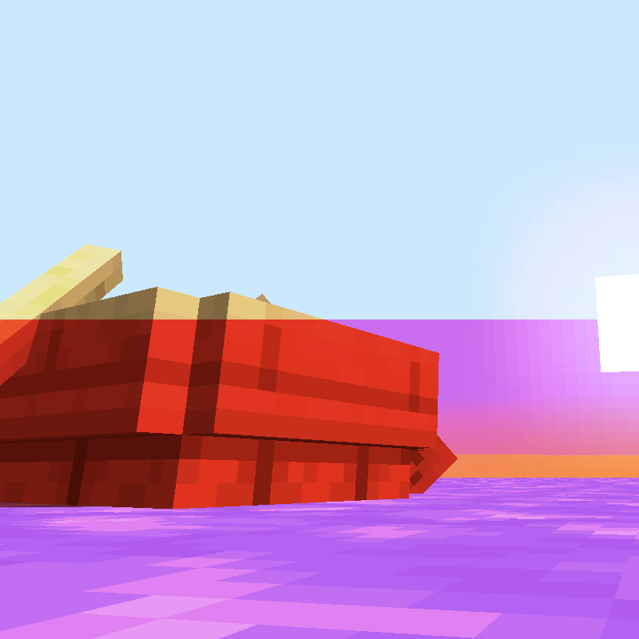
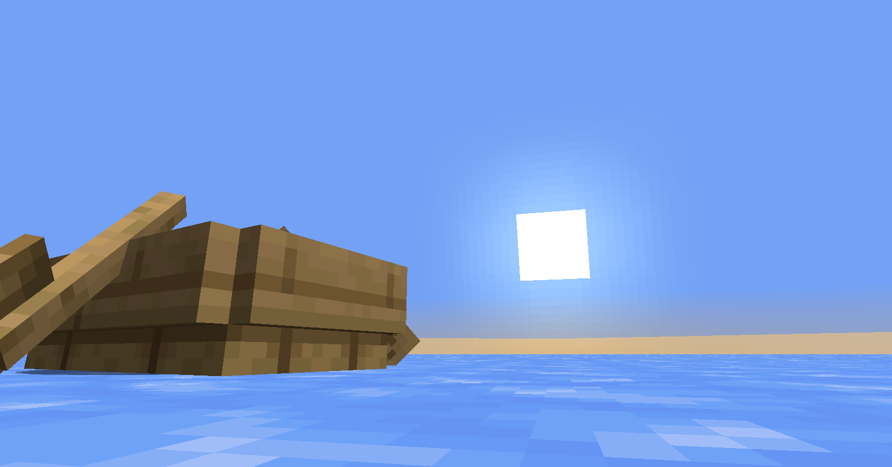

# Polish Boat Driving

Bukkit plugin solving one problem: **boat uphill running**. Some kind of Boat Step Up, with player input.

What it does is makes boat go uphill after swapping item in hands (even air can be swapped).

## See it

youtube link

# Download it

- [Modrinth](https://modrinth.com/plugin/polish-boat-driving/)
- [Spigot]()

## License

Licensed under MIT. Check [LICENSE](LICENSE) file for details.